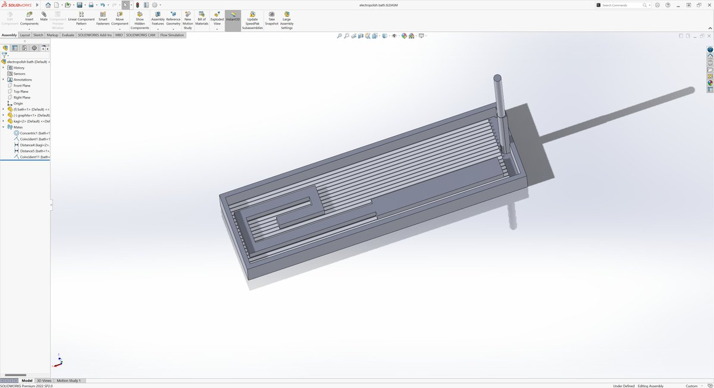

# 電解研磨実験

ある程度まともに電解研磨したい

## 1回目の実験

### 条件

- 電解液: 75% H3PO4  
- 電圧: 30V  
- 電流: 大体3Aぐらいだった  
- 電極: [グラファイト棒](https://www.amazon.co.jp/dp/B0CG9FRJVD)

リン酸が高いからケチって浅い容器を作ってみた

### 結果

でんきって、できるだけ近道したいんだよね。ケチった結果リン酸が無駄になった

### 次回予告

やっぱりケチりたい  
電極が近いところから研磨が始まるから、タングステン線を容器にいっぱい張ってみていい感じになるかみてみる